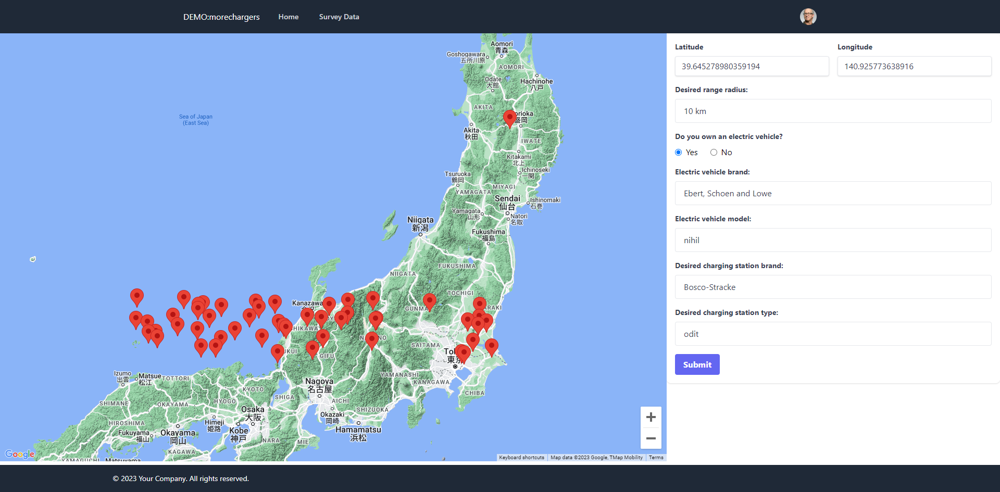
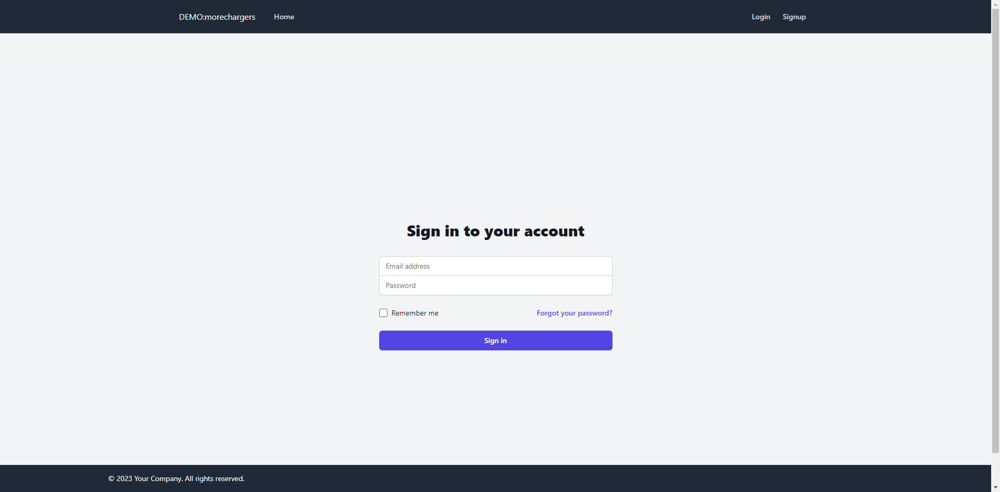
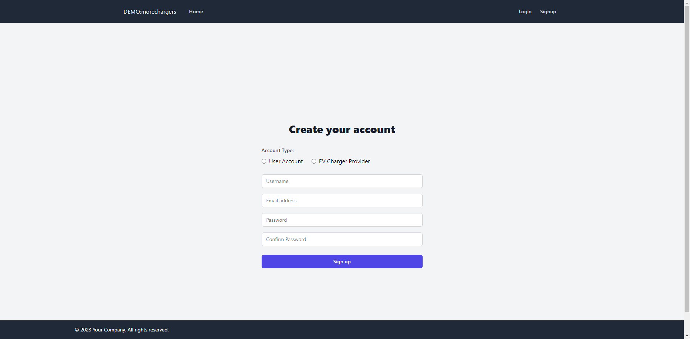
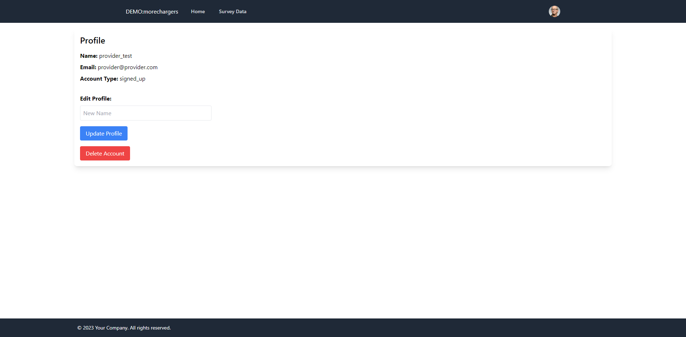
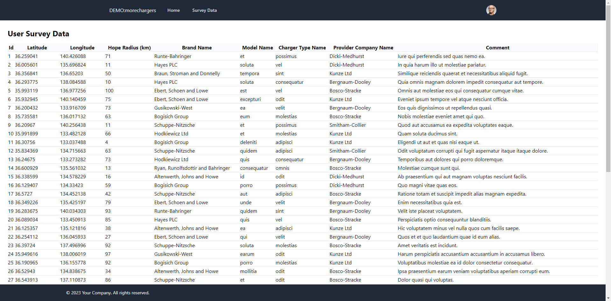
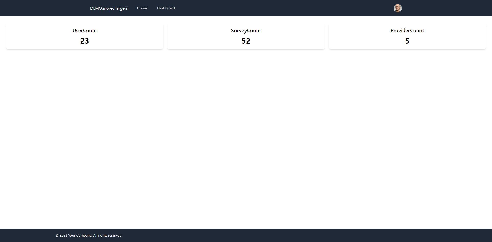

# ProjectMoreChargers
[日本語](./READMEJP.md)
## Project Description
ProjectMoreChargers is a platform that allows users to submit locations where they wish to have charging stations built, along with some user information. This data can be used by charging station providers as a reference for their construction projects.

## Demo
The project is deployed on AWS, accessible via [http://demo.morechargers.com](http://demo.morechargers.com).
## Technology Stack For Demo
- **Frontend**: Vue.js, Tailwind CSS
- **Backend**: Laravel
- **Containerization**: Docker and Laravel Sail
- **Authentication**: Laravel Sanctum
- **Testing**: PHPUnit
- **Cloud Platform**: AWS (ECS on EC2, Route53)

## Installation

### Prerequisites
Ensure you have Docker and Docker Compose installed.

### Installation Steps
1. Clone the repository
   ```bash
   git clone [repository link]
   ```
2. Based on `.env.example`, create `.env` and `.env.testing` files.
3. Start the project using Laravel Sail
   ```bash
   ./vendor/bin/sail up
   ```

## Usage
- **Demo**: The project is deployed on AWS, accessible via [http://demo.morechargers.com](http://demo.morechargers.com).

- **User Types**:
    - **Anonymous Users**: Can fill out surveys about desired charging station locations.
    - **User Accounts**: After registration, users can fill surveys, upload charging station locations, update personal information, and delete accounts.
    - **Provider Accounts**: After registration, providers can view surveys filled by users and perform all operations available to user accounts.
    - **Admin Accounts**: Have full privileges, including account deletion, user information updates, filling surveys, and accessing the Dashboard.

## Features
- **User**:
    - Registration, login
    - Fill out charging station location surveys
    - Update personal information
    - Delete account

- **Provider**:
    - All features available to User
    - View surveys filled by Users

- **Admin**:
    - All features available to Provider
    - Account deletion
    - View Dashboard (including number of users, surveys, and charging station companies)

## Screenshots








## License
This project is licensed under the [MIT License](https://opensource.org/license/mit/).
